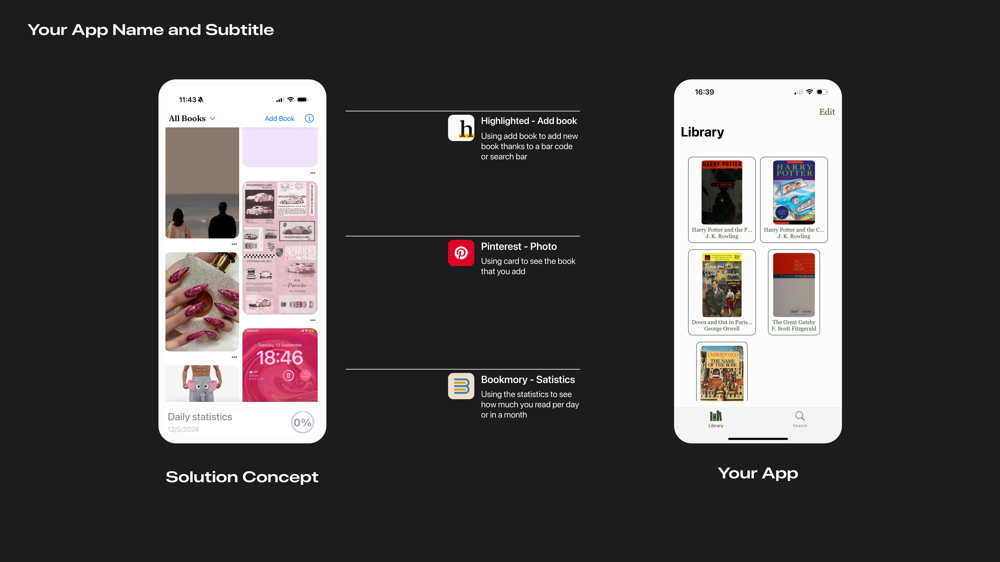

# MindShelf 📚
MindShelf is an iOS app built with Xcode that helps users find books online, save book covers, and organize them with a custom "Y-schema" (Connections, Impressions, Questions) to aid memory and understanding.

## Features
- Search for books using the [Open Library API](https://openlibrary.org/).
- Save book covers and organize them in a library view.
- Edit or delete book covers from your saved library.
- Tap on a book cover to open a detailed view where you can write your own impressions, connections, and questions for better recall and understanding.
- Designed to help with book retention and recall by using a unique schema for organizing information.

## Installation
To get started with MindShelf, follow these steps:

1. Clone this repository:  
   `git clone https://github.com/your-username/mindshelf.git`
2. Open the project in Xcode.
3. Run the app on a simulator or a connected device.

## Credits
- [Open Library API](https://openlibrary.org/) for book data and images.

## License
This project is **not available for public use**. You can only use it with my explicit consent. All rights reserved.

This app is protected by copyright law, and any unauthorized use, copying, or distribution of the code or content is strictly prohibited.
